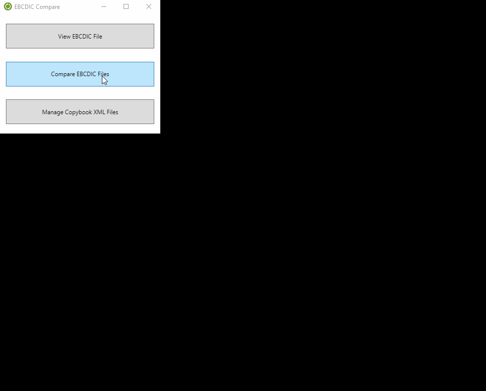
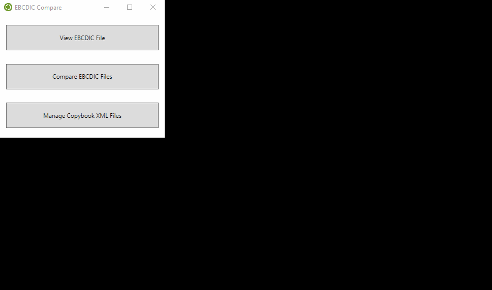

# ebcdic-compare-tool [](https://ci.appveyor.com/project/cmoresid/ebcdic-compare-tool/branch/master)  [](https://sonarqube.com/dashboard/index/ebcdic-compare-tool)  

## Installation
1. Download the [current release](https://github.com/cmoresid/ebcdic-compare-tool/releases/download/v1.0.3/ebcdic-compare-v1.0.3.zip).  
2. Unzip ebcdic-compare-v1.0.3.zip to a location of your choice.
3. To open the application, double click the ```EbcdicCompare.exe``` icon.

## Instructions
This tool allows you to view and compare EBCDIC-encoded files. In order to decode
any EBCDIC file, you will need an additional schema file that describes the fields found
in the EBCDIC file. This additional schema file, called a "copybook file", is an
XML file with a ```.fileformat``` extension that contains a description of each field
contained in the EBCDIC file. These copybook schemas reflect the COBOL copybook that
was used to write out the file initially.   

Here is an example of a copybook file:  
```xml
<?xml version="1.0" encoding="ASCII"?>
<FileFormat ConversionTable="IBM01047" dataFileImplementation="IBM i or z System" distinguishFieldSize="0" newLineSize="0" headerSize="0" >
	<RecordFormat cobolRecordName="TEST" distinguishFieldValue="0">
		<FieldFormat Decimal="0" DependingOn="" ImpliedDecimal="false" Name="ID" Occurs="1" Picture="3(9)" Signed="false" Size="9" Type="3" Value=""/>
		<FieldFormat Decimal="0" DependingOn="" ImpliedDecimal="false" Name="NAME" Occurs="1" Picture="X(12)" Signed="false" Size="12" Type="X" Value=""/>
		<FieldFormat Decimal="0" DependingOn="" ImpliedDecimal="false" Name="VALUE" Occurs="1" Picture="9(6)" Signed="true" Size="6" Type="9" Value=""/>
	</RecordFormat>
</FileFormat>
```

#### View EBCDIC File
  

**Note:** Instead of clicking "Browse" to locate a file, you can drag the file
from Windows Explorer into the appropriate file text box.  

#### Compare EBCDIC File
  

#### Associate Copybook With EBCDIC File  
If you find yourself constantly viewing / comparing the same EBCDIC files over
and over again, you can associate a copybook with an EBCDIC file so that the
next time you go to view / compare that EBCDIC file, the copybook will automatically
be selected.



## Contributions  
Contributions are welcome! Ensure that any code that you submit has at least 80%
code coverage and that solution actually builds. You can run the ```GenerateUnitTestMetrics.bat``` file to obtain this information.  

Once you are satisfied with you changes, please open up a pull request.  

## Acknowledgements
1. The EBCDIC decoding functionality was obtained from the [SummerBatch](https://github.com/SummerBatch/SummerBatch/blob/master/Notice.txt)
project.
